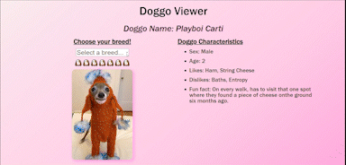

# [Doggo Generator](https://alexisintech.github.io/dog-generator/)
Choose a breed and generate a cute picture, name, and fun characteristics of your new bestfriend!

  

## How It's Made:

**Tech used:** HTML, CSS, JavaScript

## Lessons Learned:

This was my first project using a simple API and I think it was a fun twist to learn a new concept.
